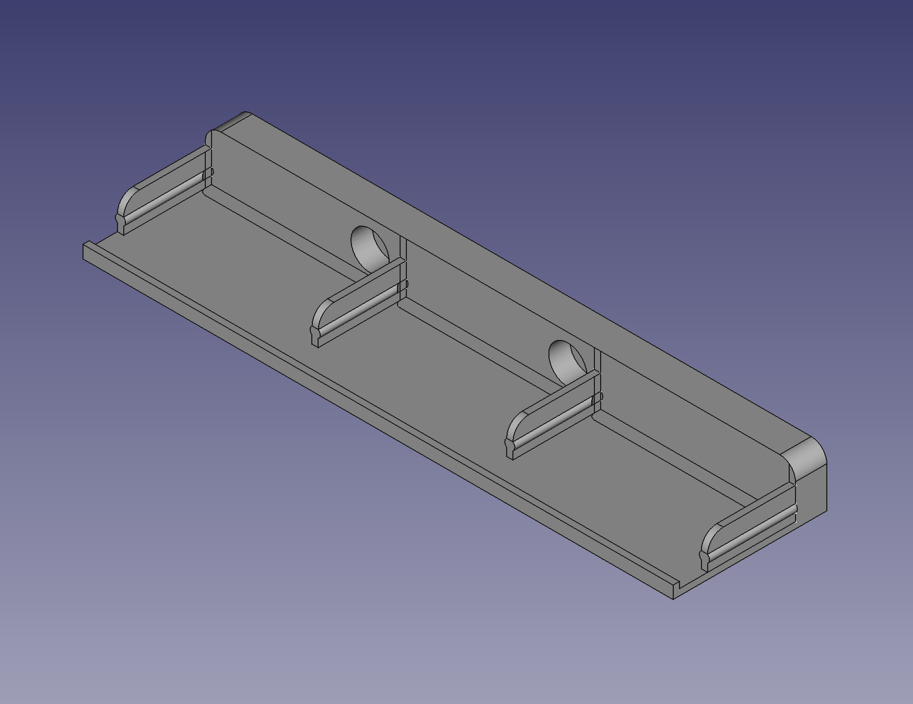
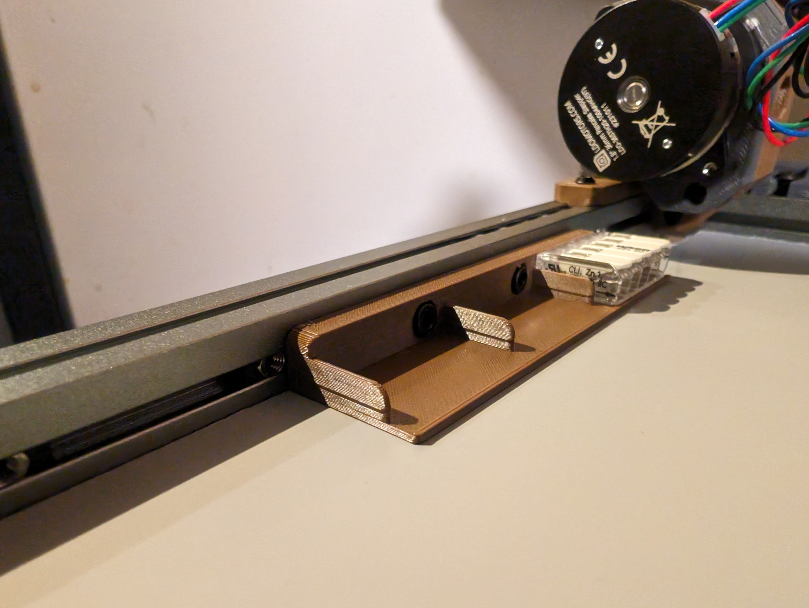
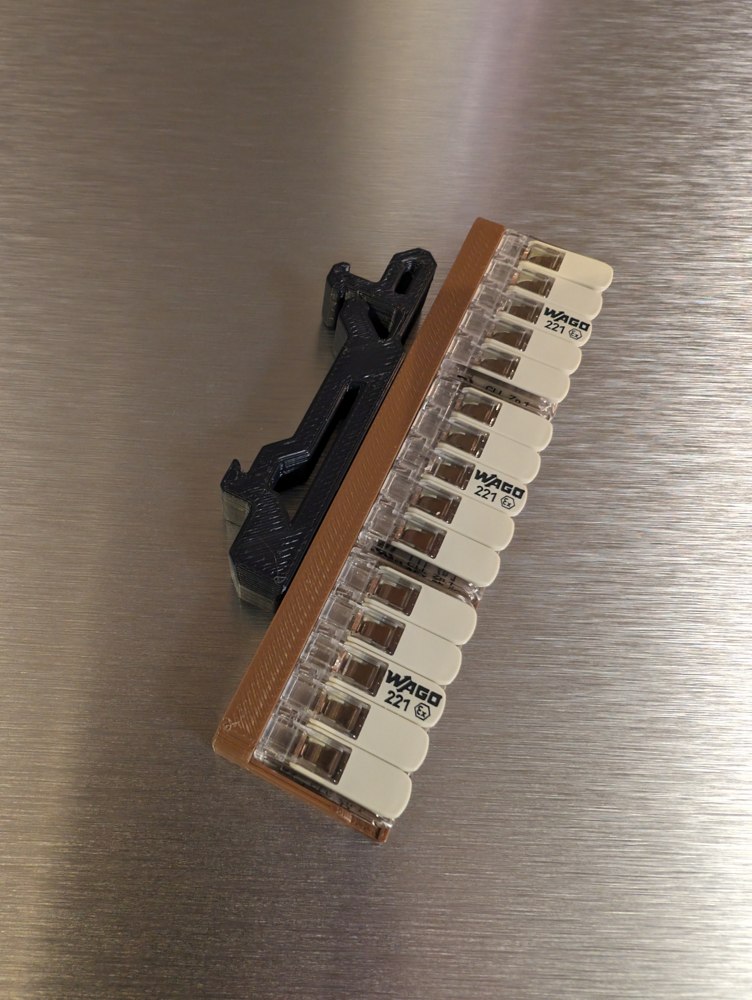

# WAGO Mount

I put this together in FreeCAD because existing mounts for 5-connector WAGO terminals
weren't fully compatible with 1515 extrusion frames, not fitting within the profile
of the frame.

This mount is 9mm thick which gives it enough clearance to mount below a Micron's
deck plate.

The mounting holes will take M3x6 or M3x8 SHCS, and they are also spaced to match
these heatset insert [DIN rail clips](https://github.com/Ramalama2/Voron-2-Mods/tree/main/DinClips)
if you don't want to mount them to a frame.
